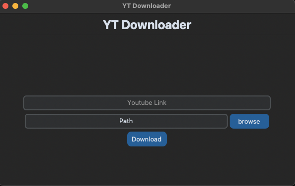

<body style="color: white"> 

#  Youtube Video Downloader

Desktop/CLI application that allows the user to download YouTube videos directly to their computer.
Developed with the use of python's front-end libraries tkinter, customtkinter, and with the use pytube on the
back-end.

<figure style="text-align: center">
    <p align="center"></p>
</figure>

The user inputs the link to the video they wish to download. Then they click on browse, which
opens a finder window that allows them to select a directory path to store the MP4 file. Lastly, they
clicked on download. Once the download is finished a message window will open to notify them and display
the path to the file

### Table of Contents

1. [Getting Started](#getting-started)
2. [Usage](#usage)
3. [Error Handling](#error-handling)
4. [Future Plans](#future-plans)

## Getting Started

Clone down this repository. You will need <a href="https://www.python.org/downloads/">Python</a>
and <a href="https://git-scm.com/">Git</a> installed globally on your machine.

## Usage

Travel to root directory
<p>Create virtual environment:</p>

```bash
$ python3 -m venv <env_name>
```

Activate environment:

```bash
$ source <env_name>/bin/activate
```

Install packages:

```bash
$ pip install -r requirements.txt
```

If you wish to use the GUI:

```bash
$ python3 main.py
```

Run the project with:

```bash
$ python3 main.py <youtube video url> <output directory path> <output name> (optional)
```

When done, run:

```bash
$ deactivate
```

## Error Handling

<figure>
    <p align="center">
        
        
    </p>
</figure>

When an invalid url is entered a message window will open to notify the user. In addition to invalid URLs,
a valid URL may not belong to a YouTube video and a message is also sent in that instance.


When the YT_Downloader is used through the terminal, messages are outputted to notify the user when the url is invalid,
or path of output directory is invalid

## Future Plans

- Option to choose video quality
- Allow user to download as an mp3

### Thank You For Visiting `!!!`

</body>
